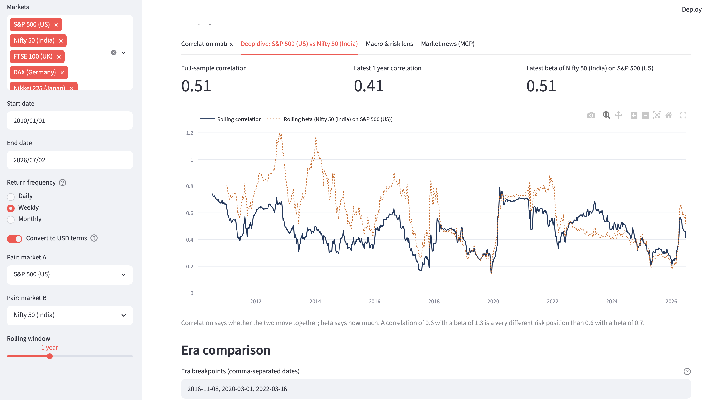

# Global Market Correlation Lab

A Streamlit app for studying how correlated global equity markets are —
built around the US-vs-India (developed-vs-emerging) question — through the
lens of asset allocation, interest rates, inflation, and risk aversion.
Market news is pulled through the **Alpha Vantage MCP server**.

## Screenshot



## Quick start

```bash
pip install -r requirements.txt
export ALPHAVANTAGE_API_KEY=your_free_key   # https://www.alphavantage.co/support/#api-key
streamlit run app.py
```

The app works without a key too — you just lose the macro overlays and the
news tab (price history comes from Yahoo Finance and needs no key).

## Architecture

```
app.py           Streamlit UI: 4 tabs, all parameters in the sidebar
data_sources.py  Prices (yfinance), FX conversion to USD, VIX/10Y,
                 Alpha Vantage macro series (Fed funds, CPI, yields)
analysis.py      Log returns, correlation matrix, rolling corr & beta,
                 era comparison, VIX-regime-conditioned correlation
mcp_news.py      MCP client -> https://mcp.alphavantage.co (NEWS_SENTIMENT
                 tool), with a REST fallback if MCP is unavailable
```

To swap in a different financial institution's MCP server, change
`MCP_SERVER_URL` and the tool name/arguments in `mcp_news.py` — the client
session code is generic.

## Methodology notes (why the defaults are what they are)

- **Weekly returns by default.** India's market closes before the US opens,
  so same-calendar-day daily correlations understate the true linkage.
  Weekly aggregation absorbs the time-zone offset.
- **USD terms by default.** For an allocator sitting in USD, the relevant
  return is index + currency. INR depreciation is part of the emerging-
  market risk you're measuring. Toggle off for local-currency analysis.
- **Beta alongside correlation.** Correlation says whether markets move
  together; beta says how much. Both matter for sizing.
- **VIX-regime conditioning.** Correlations always converge in stress
  ("all correlations go to 1 in a crisis"). The tercile split tests whether
  the US–India correlation rise since ~2020 also shows up in *calm*
  regimes — which is the actual evidence for a structural shift (deeper FII
  participation, a globally synchronized rate/inflation cycle post-2022)
  rather than episodic risk-off convergence.
- **Era breakpoints.** Defaults mark Nov 2016, the COVID crash (Mar 2020),
  and the start of the Fed hiking cycle (Mar 2022); edit them freely in
  the deep-dive tab.

## Known limitations

- Yahoo Finance index histories occasionally have gaps or late restatements;
  correlations use pairwise-complete observations to be robust to this.
- Alpha Vantage free tier is rate-limited (25 requests/day); macro series
  are cached for 24h and news for 15 minutes to stay under it.
- India-specific macro (RBI repo rate, India CPI) isn't on Alpha Vantage;
  a natural extension is adding a small CSV loader for RBI/MOSPI data.
# Market-Correlation-Lab
